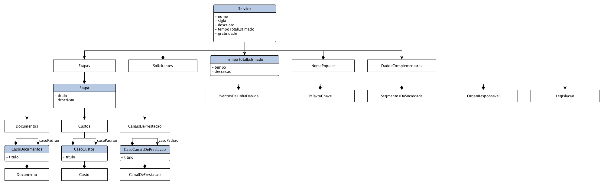

# Diagrama entidade relacionamento

Diagrama do modelo de dados de um serviço, representando a definição em [XSD e XML][CARTAS]. Este não é um modelo representando as tabelas de banco de dados, a definição de um serviço é representada por seu [XSD e XML][CARTAS], que podem ser encontradas no [Github][REPO]. 

Os documentos XML dos serviços são disponibilizados como dados abertos em seu respectivo repositório no [Github][REPO], e portanto não depende de uma base de dados persistente para seu funcionamento. Essa responsabilidade de ter os serviços em uma base de dados, é uma decisão das aplicações que estão interessadas nesses dados.

[CARTAS]: https://github.com/servicosgovbr/cartas-de-servico/tree/master/cartas-servico/v3
[REPO]: https://github.com/servicosgovbr/cartas-de-servico
[DOCS]: http://servicosgovbr.github.io/
